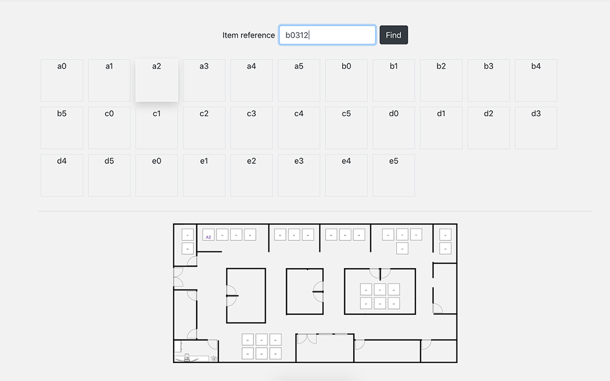

# warehouseFinder

A React toy app to help you find your stored stuff indentified by a 5 caracters tag. See [docs](./DOCS.md) for more information.

## Installation

Copy and navigate to repository folder :  
`$ git clone https://github.com/petitkriket/warehouseFinder.git && cd warehouseFinder`

Then to install depedencies :  
`$ yarn install`

## Start and use

To start the app do :  
`$ yarn start`  
Open [http://localhost:3000](http://localhost:3000) to view it in the browser.

## About

Done with [React](https://github.com/facebook/create-react-app) and Draw.io
